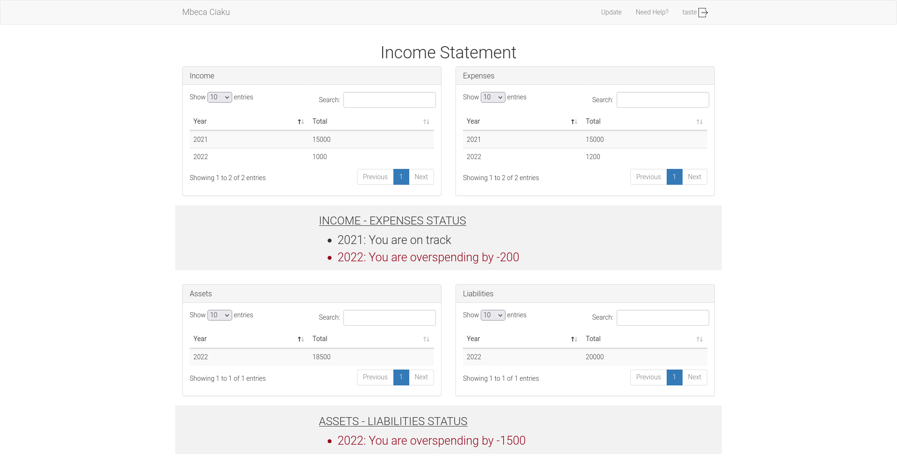

# Mbeca Ciaku

Mbeca (pronounced as 'besha') means "money" and Ciaku (pronounced as 'shiaku') means "mine" in Kikuyu, one of the venacular languages in Kenya. Put together, you get "My money". This project is aimed at helping a user to visualize his money.


## Table of Contents
- [Overview](#overview)
- [Features](#features)
- [Tools Used](#tools-used)
- [Design](#design)
- [Contributors](#contributors)
- [License](#license)
- [Deployed Application](#deployed-application)
- [User Roles](#user-roles)
- [How To Use The Application](#how-to-use-the-application)
- [Testing The Application Locally](#testing-the-application-locally)
- [Areas of improvement](#areas-of-improvement)

## Overview


For many years, I have used Google Sheets to record how my money comes in and goes out. At the end of each day, preferably at night, I consistently update this file with the current state of my money.


It works well, but it is quite cumbersome to use over a long period of time. For example, I have to manually create the table structures occassionally. I also have to manually add the formulas to generate a chart of my income and expenses. Google Sheets allows me to organize my data, and the data is presentable, but if I cannot quickly visualize this data, then it is hard to know what is going on.


Besides detailed budget, income and expenses data, I wanted to have a summary of the health status of my money. I would compare my expenses to my budget and see if I was spending too much. Of course, expenses are made possible by my income. This cashflow is what can enable one to buy an asset and experience freedom or live a liability-filled life.


Mbeca Ciaku is an attempt to create an easier solution to this small problem. Besides simplicity, I wanted to make an application that would be usable by multiple other people. These users can download their data for offline analysis. The downloaded data would be organized and encrypted in a PDF file.

### Sample income data on Mbeca Ciaku


### Sample financial statement on Mbeca Ciaku





Inspired by [MPesa](https://en.wikipedia.org/wiki/M-Pesa), I found the encryption process of personal data very interesting. This feature is really useful. In the MPesa context, the need to guard against the rampant MPesa fraud cases is critical. If you are an active MPesa user, sometimes you would like to refer to your transactions to settle a dispute, confirm a payment, or to make a complaint. Whatever the case, [Safaricom](https://www.safaricom.co.ke/) allows you to easily request for a copy of your transaction data for free. The statement would be sent to you via email. This file is encrypted and can only be accessed by you. At the time of this writing, decrypting the file is dependant on the user providing their National ID number plus a one-time numeric token sent to their phone. The decryption format is "ID-token". 

## Features

- [x] Password-based user authentication
- [x] Two-factor authentication
- [x] Custom super user (aka admin)
- [x] Custom user roles
- [x] Email notification
- [x] Interactive tables with search, sort and pagination functionality
- [x] Download of user data as PDF file
- [x] Encryption of downloaded PDF file
- [x] Tests
- [x] Custom support dashboard
- [x] Dynamic charts
- [x] Password reset
- [x] Rich text integration and preview


## Tools Used

- [x] [Flask](https://flask.palletsprojects.com/en/2.1.x/) (Python framework)
- [x] [Flask Bootstrap](https://pythonhosted.org/Flask-Bootstrap/) for styling and cross-browser responsive design
- [x] [Flask-WTF](https://flask-wtf.readthedocs.io/en/latest/) for form validation
- [x] [Flask-Login](https://flask-login.readthedocs.io/en/latest/) for user authentication
- [x] [Flask-Mail](https://pythonhosted.org/Flask-Mail/) for email notification
- [x] [Flask-SQLAlchemy](https://flask-sqlalchemy.palletsprojects.com/en/2.x/) for database management
- [x] [Flask-Migrate](https://flask-migrate.readthedocs.io/en/latest/) for database migrations
- [x] [PyFPDF](https://pyfpdf.readthedocs.io/en/latest/) for PDF generation
- [x] [PyPDF2](https://pypdf2.readthedocs.io/en/latest/) for PDF encryption
- [x] [Unittest](https://docs.python.org/3/library/unittest.html) for unit testing
- [x] [ChartJS](https://www.chartjs.org/) for data visualization
- [x] [Twilio Verify API](https://www.twilio.com/docs/verify/api) for SMS verification 
    - To work with Twilio Verify API, you need to have a Twilio account. Learn more about it [here](https://github.com/GitauHarrison/notes/blob/master/two_factor_authentication/twilio_verify_2fa.md).
- [x] [Flask pagedown](https://pypi.org/project/Flask-PageDown/0.1.3/) for Markdown support on both the client and the server


## Design

- [x] [Mbeca Ciaku](https://www.figma.com/proto/s8DMkx68mQGg3dqEdnNb7p/Mbeca-Ciaku?node-id=2%3A2&starting-point-node-id=2%3A2) on Figma


## Contributors

[](https://github.com/GitauHarrison/mbeca-ciaku/graphs/contributors)


## License

- [x] [MIT](LICENCE) license


## Deployed Application

- [x] [Mbeca Ciaku](https://mbecaciaku.herokuapp.com/) on Heroku


## User Roles

Admin

- Has a private link to login
- The idea is to have no registration page for the admin, but since this is a test application, I have included a link to the registration page.
- Adds the support team responsible for for answering user questions
- Can delete support team members permanently

Support Team

- Responsible for answering user questions and providing support
- Has a private link to login
- They cannot register themselves; only done by the admin
- Once registered, their login credentials are automatically sent to them via email
- Receives email notifications when there is a new question

User

- A random user can register themselves
- They will be required to authenticate themselves before they can access the application
- Can update their financial information (budget, income, expenses, assets, liabilities)
- They can download their data as an encrypted PDF file


## How To Use The Live Application

- [Watch on YouTube]()

Alternatively, you can do the following:

[Browser 1 ([Brave](https://brave.com/))] Ceate an Admin
- [x] [Create a new admin](https://mbecaciaku.herokuapp.com/auth/admin/register)
- [x] [Login as admin](https://mbecaciaku.herokuapp.com/auth/admin/login). You will be redirected to the admin dashboard.
- [x] Create a new support team member


[Browser 2 ([Firefox](https://www.mozilla.org/en-US/firefox/new/))] Login as Support Team

- [x] Find the login details to your support account in the email you received.
- [x] [Login as support team](https://mbecaciaku.herokuapp.com/auth/support/login). You will be redirected to the support dashboard.
- [x] Click on "Answer" link to respond to a user's question. The user will recieve an email notification.


[Browser 3 ([Chrome](https://www.google.com/chrome/))] Register as User

- [x] [Create a new user](https://mbecaciaku.herokuapp.com/auth/register)
- [x] [Login as user](https://mbecaciaku.herokuapp.com/auth/login). You will be redirected to the user home page.
- [x] [Update your financial information](https://mbecaciaku.herokuapp.com/update)
- [x] User can optionally download their data as an encrypted PDF file.
- [x] Need help? [Contact support team](https://mbecaciaku.herokuapp.com/help)


## Testing The Application Locally

1. Clone the repository


    ```python
    $ git clone git@github.com:GitauHarrison/mbeca-ciaku.git
    ```

2. Change to the repository directory


    ```python
    $ cd mbeca-ciaku
    ```

3. Create and activate a virtual environment


    ```python
    $ virtualenv venv
    $ source venv/bin/activate

    # OR using virtualenvwrapper

    $ mkvirtualenv mbeca-ciaku
    ```


4. Install dependencies


    ```python
    (mbeca-ciaku)$ pip3 install -r requirements.txt
    ```


5. Create `.env` file in the root directory to store all needed environment variables


    ```python
    (mbeca-ciaku)$ touch .env
    ```


6. Update `.env` file with the variables seen in `.env-template` file in the repository root directory


    ```python
    # Example .env-template file

    SECRET_KEY=
    PDF_FOLDER_PATH=
    QUESTIONS_PER_PAGE=
    ```

    Note on how to generate a random string for the `SECRET_KEY` variable:

    ```python
    # On terminal
    $ python -c "import os; print(os.urandom(24))"

    # Output: b'\xc5\xdd\xb3s\xab<\xcc;h$>\x83f>e$\x03\xb8\xc8\xd1\xce\tZ\xd1'

    # Or

    (mbeca-ciaku)$ python -c 'import secrets; print(secrets.token_hex(16))'

    # Output:  ff4fcb6dc2243c5050677dca63c05112

    # Or

    # Get random value from https://www.grc.com/passwords.htm

    ```


7. Run the application

    ```python
    (mbeca-ciaku)$ flask run
    ```


8. Paste the localhost URL http://127.0.0.1:5000  into your browser. You should be able to see the application.


9. Run the tests

    ```python
    (mbeca-ciaku)$ python3 -m tests.py
    ```

## Areas of Improvement

- [ ] User interface design
- [ ] Proper display of multiple graphs on specific charts (based on the month an item is keyed in)
- [ ] Scheduled email notifications to remind users to update their data at the end of a day